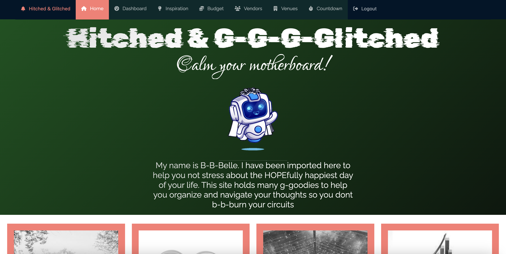

  # Hitched & Glitched
  
  ## Description 

  { width="200px" }
  
  Welcome to Hitched & Glitched, your go-to wedding planning website that ensures your dream wedding becomes a seamless reality. Our platform is meticulously crafted using the cutting-edge MERN stack (MongoDB, Express.js, React.js, and Node.js), alongside GraphQL and Apollo, to provide you with a contemporary and streamlined wedding planning experience. As a Progressive Web App (PWA), Hitched & Glitched delivers unmatched convenience, allowing you to plan and manage your perfect wedding effortlessly.
  
  ## Table of Contents
  * [Technology Stack](#technology-stack)
  * [User Story](#user-story)
  * [Installation](#installation)
  * [Heroku Deployment](#heroku-deployment)
  * [Screenshot](#screenshot)
  * [Deployed Page](#deployed-page)
  * [The Team](#the-team)
  * [The Team Tasks](#the-team-tasks)
  * [Outside Resources](#outside-resources)
  * [License](#license)

  ## Technology Stack


  ## User Story

  ```md
  AS A newly engaged couple
  I WANT a modern and user-friendly wedding website
  SO THAT I can easily save wedding inspirations, manage my budget,  
  have a countdown to the big day, and efficiently search for venues and vendors.
  ```
  
  ## Installation 

  * Ensure you are running Node.js v16.  
  * Clone the repository.
  ```
    git clone git@github.com:erin-m-keller/hitched-and-glitched.git
  ```
  * Install the dependencies.
  ```bash
    npm i 
  ```
  * Create .env file in the ROOT folder, and add MongoDB Atlas Database connection URL.
  ```bash
    MONGODB_URI="value goes here"
  ```
  * Create .env file in the server folder, and add a unique value to the SECRET key.
  ```bash
    SECRET="value goes here"
  ```
  * Create .env file in the client folder, and add api keys/secrets.
  ```bash
    REACT_APP_UNSPLASH_KEY = ""
    REACT_APP_UNSPLASH_SECRET = ""
    REACT_APP_GOOGLE_KEY = ""
  ```
  * Build the application.
  ```md
    npm run build
  ```
  * Start the application.
  ```md
    npm run start:dev
  ```
  > Application is available at: http://localhost:3000/  
  > GraphQL is available at: http://localhost:3001/graphql

  ## Heroku Deployment

  Follow the deployment instructions found [here](https://gist.github.com/erin-m-keller/dc64052000e99eff9c6c91796b011027).

  ## Screenshot
  
  
  
  ## Deployed page

  [View Published Page](https://hitched-and-glitched-697b7a3de50f.herokuapp.com/)

  ## The Team

  [Adrena Lewis](https://github.com/x3n0g3n)  
  [Dallen Hatton](https://github.com/Dhatton01)  
  [Hayden Lenca](https://github.com/HaydenLenca)  
  [Erin Keller](https://github.com/erin-m-keller)  
  [Samuel Joseph](https://github.com/josephash)

  ## The Team Tasks 

  **Adrena Lewis**: Dashboard, Venues  
  **Dallen Hatton**: Countdown  
  **Hayden Lenca**: Budget Tracker  
  **Erin Keller**: Authentication, Dashboard, Inspiration, PWA Setup  
  **Samuel Joseph**: Vendors

  ## Outside Resources

  * [Ant Design](https://ant.design/components/overview/)
  
  ## License 
  [](https://lbesson.mit-license.org/)
